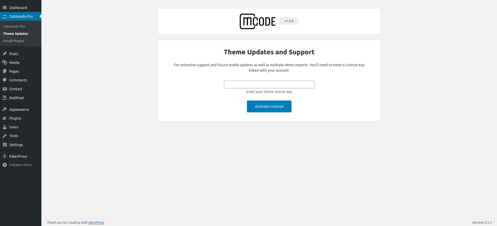

# How do I get the theme license key?

After you purchase the theme, you can get your license key at checkout confirmation and copy it. You will receive an email as well. 

For future, goto **`www.codemanas.com > my account > purchase`** history page after logging in. In your account section your will find your keys.

---

# Activating Theme Basics

After activating theme, you will need to follow few steps:

1. After Catmandu Pro is activated you will be redirected to Catmandu Pro Theme Page.
2. First step is to insert a License key for the theme. 
3. You won't be able to **`import demo data`** if license key is not added.
4. Add a license key from **`wp-admin > Catmandu Pro > Theme Updates`** page show below

