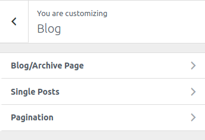
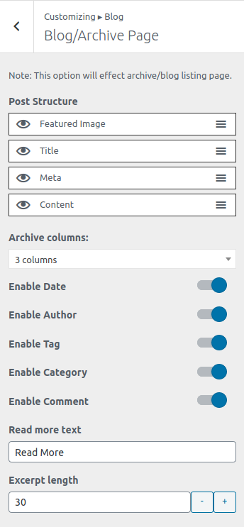
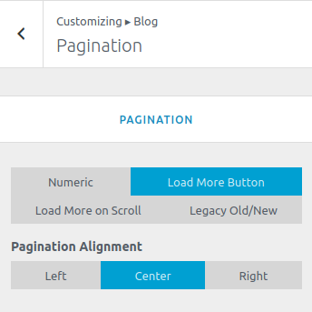

<i>To work on this option, go to **Catmandu Pro -> Theme Customizer**</i>

---

***Blog options allows you to manage the options in blogs, single, pagination and archive pages.***

## Blog/Archive page

1. **Post Structure**  - Sort the `Faatured Image`, `Title`, `Meta` and `Content` by just simple drag and drop.
2. **Archive Column:** - Manage the column layout of the archive and blog page. There are 4 columns layout options
3. **Enable Date**
4. **Enable Author**
5. **Enable Tag**
6. **Enable Category**
7. **Enable Comment**
8. **Read more text** -  Input the read more text for the excerpt on the blog or archive pages.
9. **Read more length** - Input the excerpt length to be displayed.

## Single Posts

This works only on single posts.

3. **Enable author info ? **
4. **Enable pagination ?**

## Pagination

1. Select the type of pagination namely: `Numeric`, `Load More Button`, `Load More on Scroll`, `Legacy Old/New` 
4. **Pagination Alignment** - Wheather to align the pagination in `Left` or `Center` or `Right`

