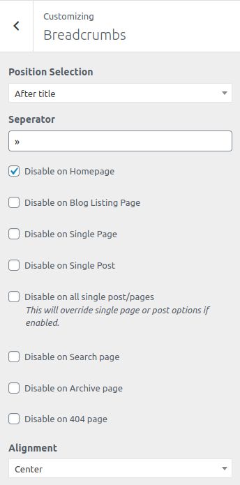

<i>To work on this option, go to **Catmandu Pro -> Theme Customizer**</i>

---

***Breadcrumb options allows you to manage the breadcrumb in the theme.***

For enabling Breadcrumbs you'll need to install and activate and activate plugin [Breadcrumb NavXT](https://wordpress.org/plugins/breadcrumb-navxt/) by John Havlik

This should be activated if you have activated all recommended plugins suggested during the setup process of the theme.

Following options are included in this section:

1. **Choosing position of breadcrumb** - Wheather to show breadcrumb before or after the title
2. **Seperator type** - What to separate the breadcrumbs
4. **Disable in specific pages like homepage, blog listing, single page or post etc**
6. **Alignment** - Wheather to align the breadcrumb in `Left`, `Right` or `Center`

