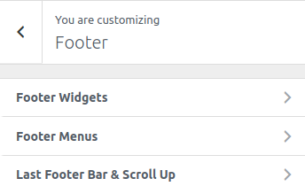

<i>To work on this option, go to **Catmandu Pro -> Theme Customizer**</i>

---

***Footer options manage the footer section of the site.***

## Footer Widgets

Widgets should be active on the footer widget area for these options to work

1. **Widget Layout Columns**  - Choose the layout of columns, wheather to show `none or 1 or 2 or 3 or 4 columns`
2. **Widget area background Color**
3. **Foote widget heading color** - Choose color for the footer widget title

## Footer Menus
1. **Enable footer menu** <i>Footer menu should be assigned for this to work</i>
2. **Footer menu position**
3. **Enable social links**
4. **Social links** - Just input your social media links and icon will be assigned automatically.
5. **Background color**

## Last Footer Bar & Scroll Up

1. **Enable Bottom Footer Bar**
2. **Copyright content**
3. **Site info content**
4. **Background Color**
5. **Enable scroll up**
6. **Scroll up background color**

