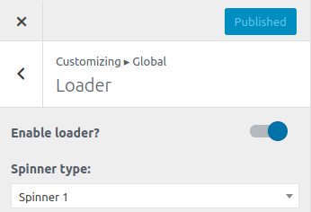

<i>To work on this option, go to **Catmandu Pro -> Theme Customizer**</i>

---

***Global options allows you to override colors, containers, typography, buttons and loaders of overall site from one setting.***

## Container

In this section you can customize overall container width of your site. Default is set to 1230. 

**Types of Layouts supported:**

1. Boxed - Show the layout of selected page in boxed layout.
2. Full width - Show the layout of selected page in full width.

You can override different layouts for different pages. Like blog layouts, page layouts, single post layouts etc.

---

## Loader

1. **Enable loader?**  - Enable/disable loader on the site.
2. **Spinner type:** - Select the type of spinner you want while laoding the site

---

## Typography

You can control individual body typography or individual type of heading typography ranging from ( H1 to H6 ). This setting includes following:

1. **Body Font** - Change the `font family and variant` of the whole site.
2. **Heading Font: H1** - Change the `font family, variant and font size` of the `H1` tag.
3. **Heading Font: H2** - Change the `font family, variant and font size` of the `H2` tag.
4. **Heading Font: H3** - Change the `font family, variant and font size` of the `H3` tag.
5. **Heading Font: H4** - Change the `font family, variant and font size` of the `H4` tag.
6. **Heading Font: H5** - Change the `font family, variant and font size` of the `H5` tag.
7. **Heading Font: H6** - Change the `font family, variant and font size` of the `H6` tag.

---

## Colors

Colors gives you capability to customize the background and theme scheme of the whole site.

1. **Body Background Color** - Change the background color of the whole site.
2. **Theme Color** - Change the color scheme of the whole site. `red` is the default color scheme. Changing this will change the color and background color of all the elements

## Buttons

Buttons gives you capability to customize the button size and design on the overall site.

1. **Button design** - Change the button design ranging from `default, semi curved and curved`.
2. **Button size** - Change the size of the button from `large to extra small`

