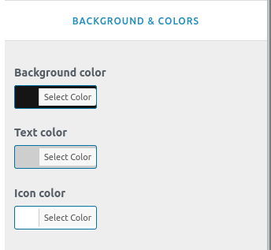
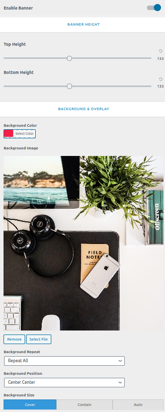

<i>To work on this option, go to **Catmandu Pro -> Theme Customizer**</i>

---

***Header options allows you to override header layout of the theme.***

## Site Identity

This section is pretty basic, you can change logo of site from here. Decide to show Site title, tagline or hide them and much more 

1. **Logo**  - Manage your site logo.
2. **Site Title:** - Manage your site title.
3. **Tagline:** - Manage your site tagline.

4. **Site Logo Width & Site Titles** - Manage logo width; enable/disable title and tagline; manage typography of title and tagline 

4. **Site Favicon** - Site Icons are what you see in browser tabs, bookmark bars, and within the WordPress mobile apps. Upload one here! Site Icons should be square and at least 512 × 512 pixels.

---

## Primary Header & Menus

1. **Disable Menu**  - Check to disable primary menu.
2. **Header Layout:** 
	- Manage the menu design whether to do `Left Logo | Right Menu` or `Right Logo | Left Menu` or `Center Logo` <i>This will not work on  `Header 2`</i>
					 
	- Manage header layout design selecting from `Header 1` or `Header 2`

3. **Menu Section**
	- Check to disable search on menu
	- Check to disable mini cart on menu
	- Select what to display as the last item on the menu either `none` or `Button` or `Text/HTML`

4. **Menu Colors** :  Change menu color, hover color and active menu color
4. **Sub menu Colors** :  Change color, hover color and active color of sub menu items
4. **Mobile menu & colors** :  Change background color, link color and hamburger menu color

---

## Top Header

You can control content and color of Top Header from this setting

1. **Enable Top Header ?** - Toggle to enable the top header
2. **Quick contact:** - Add quick contant info using repeater provided. You can put title, contact and icon for the contact.
3. **Social connects:** - Add the social media links. The theme will automatically assign the icon as per the link.

4. **Background & Colors** - Change the background color, text color and icon color

---

## Transparent Header

This section allows you globally enable/disable transparent headers. Show in all pages or just one ?

1. **Enable Transparent Header Globally ( Disabled by default )**
2. **Disable on Blog/Posts page only**
3. **Disable on serach pages only**
4. **Disable on archive page only**
5. **Disable on single page only**
6. **Disable on single post only**
7. **Disable on all single post/pages only**
8. **Disable on 404 pages**
9. **Transparent Background Color Control, Border and Colors**

## Sticky Header

1. **Enable Sticky Header ?** - Toggle to enable the stikcy header
2. **Sticky Background color** - Manage the background color of the menu when it is sticky.

## Inner Banner Image 

This section is affected in inner pages of site. This section will be show below the header. You can either choose a color or image to show.

1. **Enable or Disable**
2. **Banner height**
3. **Background Image or Background Color**
4. **Choose Background Repeat, position, size, scroll or fixed image, background overlay color**
5. **Show page title**
6. **Page title typography**

