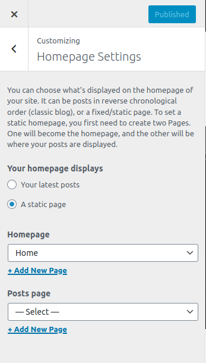

<i>If you have not imported demo data or demo imported does not setup the homepage on it's own, follow the instructions below:</i>

---

## Setting up Home Page

1. In your admin panel, go to **Pages** and click the **Add New** button.
2. Give your page a title like **Home**
3. On the right panel of the editor, click **Document** and open **Page Attributes** tab.
4. Choose **Homepage** from the **Template** dropdown.
5. Publish the page and your custom homepage is ready.

6. Now go to **Catmandu Pro** and click **Theme Customizer **
7. Then clikc on **Homepage Settings** section 
8. From there, select **A static page** on **Your homepage displays**

