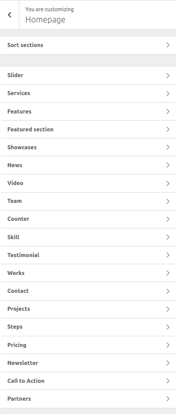
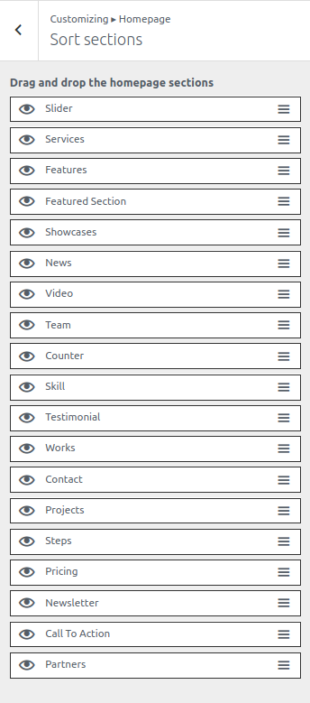
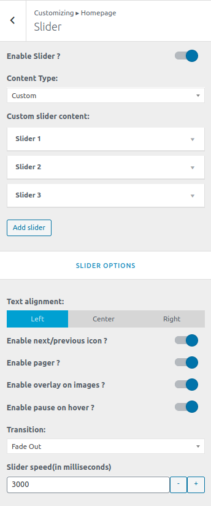
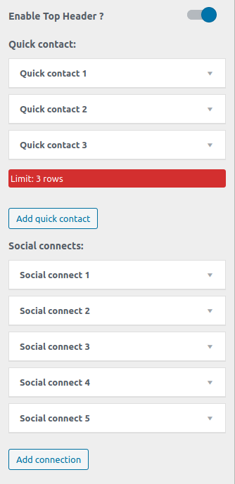
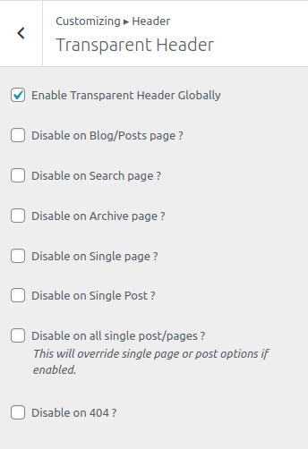
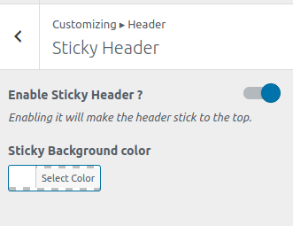
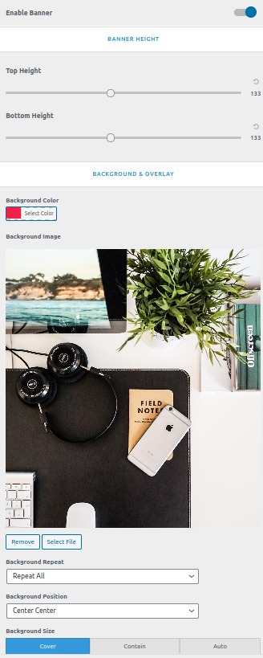

<i>To work on this option, go to **Catmandu Pro -> Theme Customizer**</i>

---

***These options will only work on the page that is assigned the `Homepage` template***

## Sort sections

You can sort the homepage sections just by simple drag and drop. 

You can also show/hide the section by clicking on the `eye` icon.

---

## Slider

1. **Enable Slider ?**
2. **Content Type:** - Choose the type of content you want the section to be built from: `Post`, `Page`, `Category` or `Custom`. Other options will be visible based on the content type selected.
3. **Text alignment** - Wheather to align the text on the slider to the `left`, `right` or `center`
4. **Enable next/previous icon ?**
5. **Enable pager ?**
5. **Enable overlay on images ?** - Enabling this will pull off a black overlay on the image
5. **Enable pause on hover ?** - Slider will be paused when hovered over it.
5. **Transition** - Select how you want the next slider to transit.
5. **Slider speed(in milliseconds)** - Input the time in milliseconds for the next slide to appear.

---

## Services

You can control content and color of Top Header from this setting

1. **Enable Top Header ?** - Toggle to enable the top header
2. **Quick contact:** - Add quick contant info using repeater provided. You can put title, contact and icon for the contact.
3. **Social connects:** - Add the social media links. The theme will automatically assign the icon as per the link.

4. **Background & Colors** - Change the background color, text color and icon color

---

## Features

This section allows you globally enable/disable transparent headers. Show in all pages or just one ?

1. **Enable Transparent Header Globally ( Disabled by default )**
2. **Disable on Blog/Posts page only**
3. **Disable on serach pages only**
4. **Disable on archive page only**
5. **Disable on single page only**
6. **Disable on single post only**
7. **Disable on all single post/pages only**
8. **Disable on 404 pages**
9. **Transparent Background Color Control, Border and Colors**

## Featured Section

1. **Enable Sticky Header ?** - Toggle to enable the stikcy header
2. **Sticky Background color** - Manage the background color of the menu when it is sticky.

## Showcases

This section is affected in inner pages of site. This section will be show below the header. You can either choose a color or image to show.

1. **Enable or Disable**
2. **Banner height**
3. **Background Image or Background Color**
4. **Choose Background Repeat, position, size, scroll or fixed image, background overlay color**
5. **Show page title**
6. **Page title typography**

