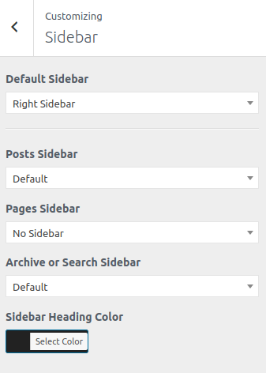

<i>To work on this option, go to **Catmandu Pro -> Theme Customizer**</i>

---

***Sidebar options allows you to manage the sidebar positions.***

Widgets should be active on the sidebar widget area for these options to work

Following options are included in this section:

1. **Default Sidebar** - Default sidebar position for all the pages
2. **Posts Sidebar** - Sidebar position only for single posts
3. **Pages Sidebar** -Sidebar position only for pages
4. **Archive or Search Sidebar** - Sidebar position for archive and search pages
5. **Sidebar Heading Color** - Color of the sidebar widget title

