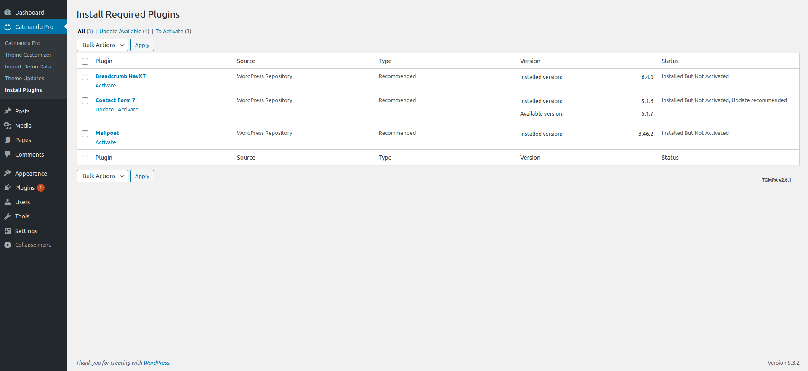
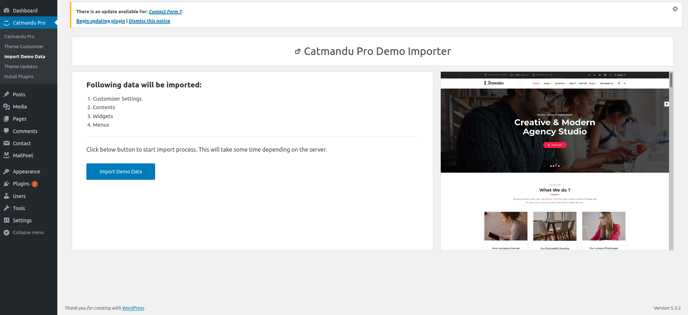

<i>In order to configure and proceed with Catmandu PRO theme you will need a theme license key.</i>

---

# Install Required Plugins

<b><i>You are required to install "required" plugins and neglect "Recommended" plugins.</i></b>

1. After license has been added. `Goto wp-admin > busify > install plugins page`.
2. You will see a list of plugins required for theme. Select all and select `install` like shown in below screenshot. 
3. Click `Apply`
4. Wait for all plugins to be installed.
5. After plugins are installed, again select all and click on `Activate` and `Apply`
6. Your Done activating all required plugins !

---

# Importing theme Demo

1. Goto ***`wp-admin > Catmandu Pro > Import Demo`*** Data page
2. Click on `Import Demo Data`
3. Wait for some time to finish this. Do not browse to other pages when being imported.
4. Your all done ! Goto your homepage to check your site.

